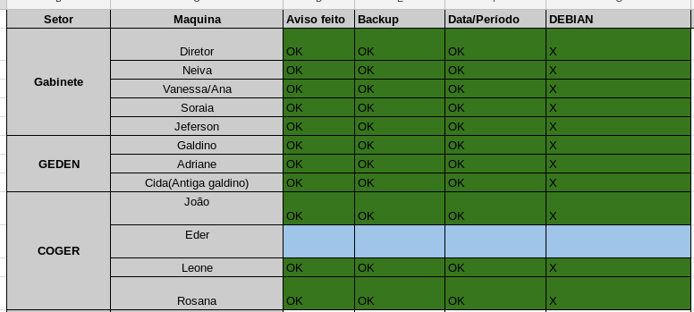

# plano_migracao_linux

Neste repositório são descritas as diretrizes e ações principais do nosso __plano de migração e padronização do sistema operacional__ utilizado na área administrativa da instituição.

Acreditamos que as informações a seguir foram a chave do sucesso do nosso case e que podem ajudar outras instituições a obterem sucesso nessa árdua tarefa.

Iniciamos o processo em março de 2016 com um universo de 130 máquinas e levamos um ano para atingir 85% do total. Os 15% restante são de máquinas de setores "críticos", ou por dificuldades técnicas ou de resistência. No final de 2017 finalizamos o plano.

Principais motivações para a migração:

* Gerente de configuração com melhor compatibilidade
* Maior facilidade de manutenção principalmente via terminal
* Equipe de TI mais capacitada para o SO
* Padronização 
* Segurança
* Melhor utilização dos recursos do hardware 
* A longo prazo, maior aceitação na implantação de estrutura com thin client com SO Linux
* Economia de recurso público em geral

## Diretrizes que consideramos fundamentais:

* __Equipe unida com o mesmo propósito e com conhecimento satisfatórios em Linux, capacitada para resolver rapidamente principais problemas:__  
Toda a equipe conhece os propósitos e sabe as principais respostas quando consultados e questionados. Foi super importante o fato da equipe utilizar sempre preferencialmente Linux e ter familiaridade com a plataforma, não somente a _server_, mas também de _desktop_. 

* __Gerente de configuração validado, operacional e eficiente:__  
É imprescindível possuir um gerente de configuração, como o [puppet](https://puppet.com), para poder aplicar configurações globalmente de forma rápida e eficaz. No decorrer da execução acontecem muitos problemas(ou necessidades de melhorias) que podem inviabilizar o plano se não forem corrigidos de forma rápida e transparente. Toda configuraço ser feita de forma centralizada(via gerente de configuração) e não local nas máquinas.

* __Sistema de clonagem de máquinas eficiente:__   
É de suma importância um gerente de clonagem de máquinas, como o [FogProject](https://fogproject.org/), para poder devolver a máquina o mais rápido possível, de preferência fazer no turno oposto ao do usuário(ou nas suas férias).

* __Principais gestores cientes do plano e conhecendo as motivações:__  
Foi de suma importância que a gestão atual entendeu e apoiou as ações. Porém, uma equipe forte e com embasamento é mais importante para ter força e não recuar nas resistências sem motivos reais. 

* __Estudar previamente cada setor, quais softwares institucionais são utilizados e criar atalhos "transparentes" para acessos remotos :__  
Utilizamos uma abordagem de acesso remoto para alguns(poucos) softwares que só rodavam no Windows. Instalamos esses em um servidor Windows centralizado habilitado para acesso remoto e configuramos atalhos que iniciam o programa remoto de forma transparente para o usuário, dando a sensação que está utilizando um programa instalado localmente. [Exemplo de módulo aplicado com o gerente puppet](https://github.com/ctic-sje-ifsc/gerenciamento_config_puppet/tree/master/environments/production/modules/remoto_ibsispes/manifests) 

* __Justificativa e necessidade. deixar claro quando os "problemas" no são causados pelo novo SO:__  
Utilizamos a premissa: existe jutificativa ou necessidade para a outra proposta? Procuramos mostrar para o usuário que vamos dar suporte a todas as necessidades institucionais dele. Também, é importante salientar aos usuários e gestores quando algum problema não é relacionados a migração em sí, pois a tendência que sugiram que a causa é sempre a migração.

* __Máquinas com serial do Windows são instaladas com DualBoot porém Windows oculto no GRUB:__  
Isso garantiu uma margem de segurança para casos extremos e pontuais, que em poucos casos foram necessários serem liberados momentaneamente.

## Passo a passo básico:

1 - Reuniões para nivelamento de propósitos e conhecimentos da equipe de TI.  
2 - Enviar email básico para todos avisando sobre a padronização e que enviarão emails individuais combinando datas.  
3 - Criar uma tabela(exemplo abaixo), com todas as máquinas e status, divididas por salas e respectivo usuário.  
4 - Definir setores menos críticos(softwares multiplataforma ou online e usuários mais acessíveis) para serem feitos primeiro.  
5 - Consultar o respectivo setor sobre todos os softwares institucionais utilizados(inclusive os pouco utilizados).  
6 - Verificar a possibilidade de utilização/migração dos respectivos softwares e criar os módulos e fazer testes.  
7 - Enviar email para um ou dois usuários por setor marcando um dia que será feito e que ele deve fazer o backup.  
8 - Devolver a máquina com o usuário presente e sentar com o usuário para explicar o básico do sistema e dos softwares para o desempenho da sua atividade institucional.  
9 - Acompanhar de perto a utilização/dificuldades/problemas do usuário e dar prioridade no atendimento desses. É muito importante essa priorização e rapidez e/ou empenho na solução dos possíveis problemas iniciais.
10 - Quando validado com os usuários de teste formatar a dos outros usuários.
11 - Dar sempre atendimento prioritário e atenção para possíveis dificuldades advindas da mudança.

Tabela da relação padronização das maquinas do Câmpus:

